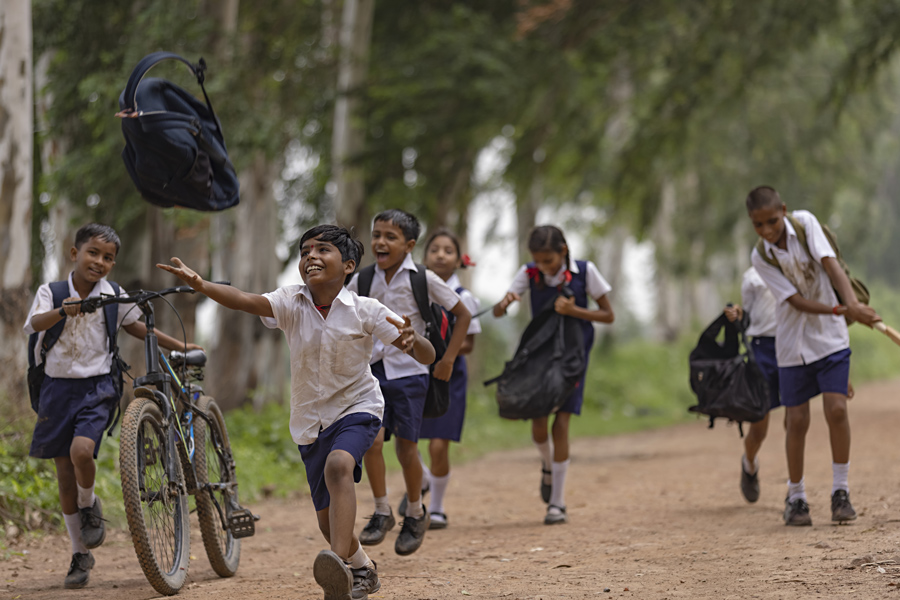

# iClick Photography Project

.jpg)

Welcome to the iClick Photography Project repository! This project showcases our photography services and portfolio using HTML and CSS. It's a simple website that allows us to display our work and connect with potential clients.

## Table of Contents

- [About](#about)
- [Services](#services)
- [Portfolio](#portfolio)
- [Pricing](#pricing)
- [Contact](#contact)

## About

In the "About" section, we introduce ourselves and our passion for photography. We talk about our team and our approach to photography.

## Services

Our photography services are highlighted in this section. We describe the types of photography we specialize in and our dedication to capturing special moments.

## Portfolio

Explore our portfolio to see some of our best work. Each image represents a unique moment captured by our team.

## Pricing

We offer various photography packages to suit your needs. Our pricing details can be found in this section.

## Contact

If you have any questions or want to get in touch with us, please use the contact form provided in this section.

